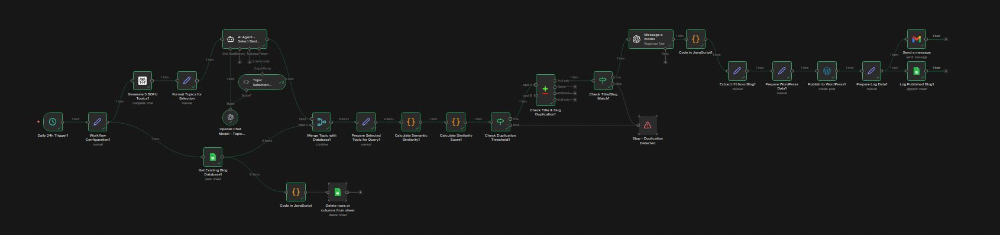

# 📝 WordPress Blog Automation System

**An end-to-end AI-powered content pipeline that automates topic research, blog generation, quality validation, and WordPress publishing.**

---

## 🚀 Overview

This project is a fully automated blogging system that generates high-quality SEO blog posts with minimal human intervention. It leverages multiple AI models and validation layers to ensure originality, relevance, and publish-ready content.

The system handles everything from **topic discovery → content creation → similarity checking → automatic publishing to WordPress**.

---

## ⚙️ Workflow

 
---

## 🔄 How It Works

### 1. Topic Discovery (Perplexity AI)
- The system uses Perplexity AI to find **BOFU (Bottom-of-Funnel)** topics.
- Focuses on **high search intent** and **conversion-driven keywords**.

### 2. Content Generation (Gemini AI)
- Gemini AI generates a **full-length, SEO-optimized blog post** based on the selected topic.

### 3. Similarity Check (Database Validation)
- The generated content is compared with previously stored blog posts.
- A **similarity score check** ensures uniqueness.
- If similarity is too high:
  - The topic is rejected
  - A new topic is generated automatically

### 4. Auto Publishing (WordPress API)
- Once approved, the blog is automatically published to the WordPress website.
- No manual intervention is required.

---

## 🧠 Complete Pipeline

Topic Research → Content Generation → Similarity Validation → Auto Publishing

The entire workflow runs fully automated, ensuring continuous content production with quality control.

---

## 🛠️ Tech Stack

- Perplexity AI (Topic Research)  
- Google Gemini (Content Generation)  
- WordPress REST API (Publishing)  
- Database (Similarity Tracking)  
- Python / Node.js (Automation Layer)  

---

## 📌 Use Cases

- Affiliate marketing blogs  
- SEO content automation  
- Content scaling for agencies  
- Niche authority websites  
- Programmatic blogging systems  

---

## 👨‍💻 Author

**Arafat Hossain Ankon**
